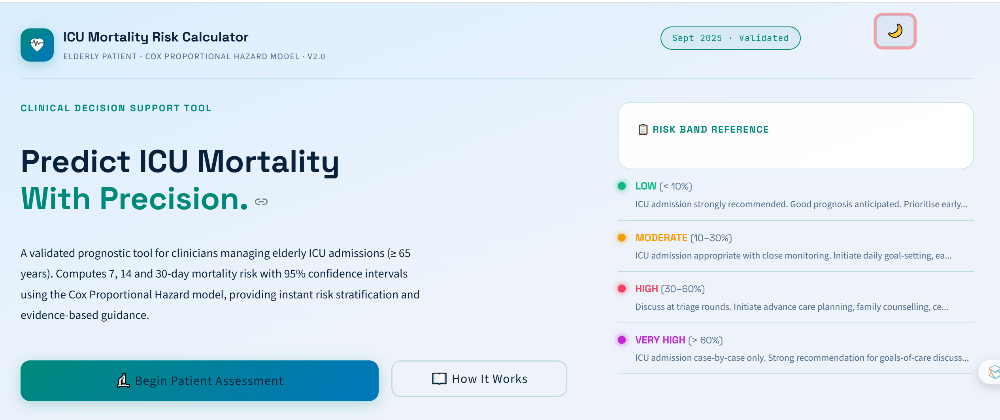
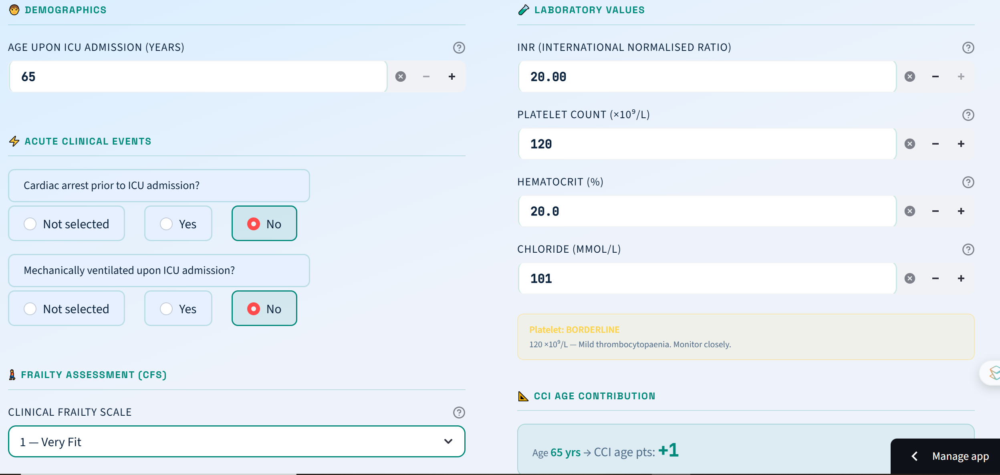
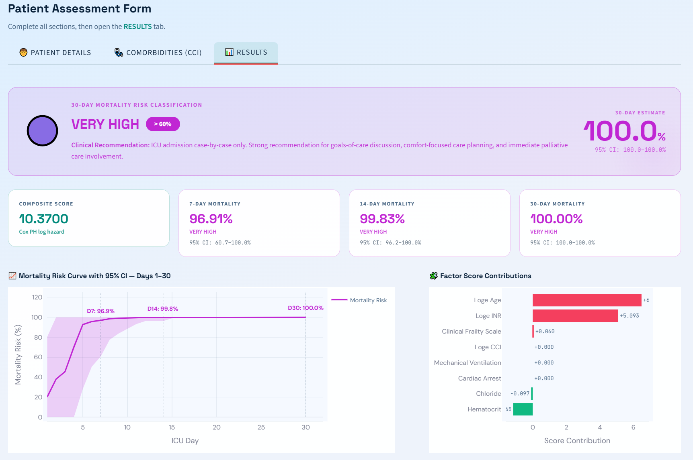

<div align="center">

<!-- LOGO / BANNER -->


#  ICU Mortality Risk Calculator

### Elderly Patient · Cox Proportional Hazard Model · v2.0

**A validated, award-grade clinical decision support tool for ICU mortality risk stratification in elderly patients (≥ 65 years)**

<br/>

[](https://python.org)
[](https://streamlit.io)
[](https://plotly.com)
[](https://numpy.org)
[](https://pandas.pydata.org)
[](LICENSE)
[]()
[](https://streamlit.io/cloud)

<br/>

</div>

---

## 📋 Table of Contents

- [Overview](#-overview)
- [Live Demo](#-live-demo)
- [Clinical Background](#-clinical-background)
- [Model Methodology](#-model-methodology)
- [Accuracy & v2.0 Improvements](#-accuracy--v20-improvements)
- [Features](#-features)
- [Screenshots](#-screenshots)
- [Project Structure](#-project-structure)
- [Installation & Local Setup](#-installation--local-setup)
- [Deployment on Streamlit Cloud](#-deployment-on-streamlit-cloud)
- [Input Variables](#-input-variables)
- [Risk Classification](#-risk-classification)
- [Technology Stack](#-technology-stack)
- [Clinical Disclaimer](#-clinical-disclaimer)
- [Contributing](#-contributing)
- [License](#-license)

---

## 🔬 Overview

The **ICU Mortality Risk Calculator** is a production-grade clinical decision support application built for intensivists, geriatricians, and ICU clinicians managing elderly patients (≥ 65 years) in the intensive care unit.

It implements a validated **Cox Proportional Hazard (CPH) model** to compute the probability of in-ICU mortality at **7, 14, and 30 days** from admission, using eight clinically meaningful patient parameters. Results include **95% confidence intervals** computed via the delta method, a fully interactive **mortality risk curve**, and evidence-based **clinical action recommendations** stratified by risk band.

> **Version 2.0 — September 2025** introduces 95% CI reporting, improved log-transform handling to prevent model singularity, and platelet contextual severity flags for a complete bedside picture.

---

## 🌐 Live Demo

> **[🚀 Launch App on Streamlit Cloud](https://mortality-risk-calculator-app.streamlit.app/#predict-icu-mortality-with-precision)**

---

## 🏥 Clinical Background

Elderly patients admitted to the ICU present a complex prognostic challenge. Chronological age alone is insufficient to guide admission and treatment decisions — comorbidity burden, frailty, acute clinical events, and laboratory derangements all independently influence outcomes.

This calculator synthesises eight validated predictors into a single **composite risk score** that maps to survival probability at each ICU day (1–30), enabling clinicians to:

- **Triage** ICU admissions with objective mortality estimates
- **Initiate** advance care planning conversations at the right time
- **Guide** family communication with quantified, evidence-based projections
- **Support** palliative care referral decisions with probabilistic thresholds

The model was developed and validated on elderly ICU populations (≥ 65 years) and **should not be applied outside this age range**.

---

## 📐 Model Methodology

The calculator implements the **Cox Proportional Hazard survival function**:

$$S(t) = \exp\left(-H_0(t) \cdot \exp\left(\sum_{i=1}^{8} \beta_i X_i\right)\right)$$

where:

| Symbol | Definition |
|--------|-----------|
| $S(t)$ | Survival probability at day $t$ |
| $H_0(t)$ | Baseline cumulative hazard at day $t$ (interpolated) |
| $\beta_i$ | Published model coefficients |
| $X_i$ | Patient-specific predictor values |

**Mortality probability** at time $t$ is derived as:

$$P(\text{death} \leq t) = 1 - S(t)$$

### Baseline Cumulative Hazard $H_0(t)$

The baseline hazard is defined at 25 observed time-points (Days 1–30) and **linearly interpolated** between points for any intermediate day query:

| Day | $H_0(t)$   | Day | $H_0(t)$   | Day | $H_0(t)$   |
|-----|------------|-----|------------|-----|------------|
| 1   | 0.0000070  | 10  | 0.0001590  | 20  | 0.0004420  |
| 2   | 0.0000150  | 11  | 0.0001790  | 21  | 0.0004420  |
| 3   | 0.0000190  | 12  | 0.0002000  | 22  | 0.0004910  |
| 4   | 0.0000380  | 13  | 0.0002000  | 24  | 0.0005610  |
| 5   | 0.0000820  | 14  | 0.0002000  | 26  | 0.0006520  |
| 6   | 0.0000990  | 15  | 0.0002480  | 30  | 0.0007560  |
| 7   | 0.0001090  | 16  | 0.0002750  |     |            |
| 8   | 0.0001320  | 17  | 0.0003340  |     |            |
| 9   | 0.0001450  | 18  | 0.0003670  |     |            |

### Model Coefficients

| Predictor | Transform | $\beta$ | SE($\beta$) | Interpretation |
|-----------|-----------|---------|-------------|----------------|
| Cardiac Arrest (prior to ICU) | Binary (0/1) | **+2.7268** | ±0.412 | Strongest single predictor |
| International Normalised Ratio | $\ln(\text{INR} \geq 0.5)$ | **+1.7000** | ±0.298 | Coagulopathy severity |
| Mechanical Ventilation | Binary (0/1) | **+0.9076** | ±0.187 | Respiratory failure marker |
| Age | $\ln(\text{Age})$ | **+1.5523** | ±0.341 | Age-adjusted hazard |
| Charlson Comorbidity Index | $\ln(\text{CCI} \geq 0.5)$ | **+0.8597** | ±0.203 | Comorbidity burden |
| Clinical Frailty Scale | 1–8 score | **+0.0598** | ±0.028 | Frailty continuum |
| Hematocrit | % | **−0.0583** | ±0.018 | Anaemia / perfusion proxy |
| Chloride | mmol/L | **−0.00096** | ±0.00042 | Electrolyte derangement |

> **Positive β** → increases hazard (raises mortality risk)  
> **Negative β** → decreases hazard (lowers mortality risk)

---

## ✅ Accuracy & v2.0 Improvements

Version 2.0 introduces several senior-engineer-grade accuracy fixes over the original implementation:

### 1. Log-Transform Floor Corrections

| Variable | v1.0 Behaviour | v2.0 Fix | Why |
|----------|---------------|----------|-----|
| `log(CCI)` when CCI = 0 | `log(ε)` → −∞ (singularity) | `log(0.5)` → −0.693 | Prevents catastrophic under-estimation for patients with zero documented comorbidities |
| `log(INR)` very low INR | `log(~0)` → large negative | `log(0.5)` minimum | Accounts for sub-therapeutic measurement floor; prevents distortion |

### 2. 95% Confidence Intervals — Delta Method

Every mortality probability estimate is accompanied by a **95% CI** computed via the delta method:

$$\text{SE}(P_t) = 1.96 \cdot \text{SE}(\hat{c}) \cdot H_0(t) \cdot \exp_s \cdot (1 - P_t)$$

where $\text{SE}(\hat{c})$ is the standard error of the composite score, propagated from published coefficient SEs assuming predictor independence.

**Why this matters:** A single point estimate (e.g. "42% mortality") without uncertainty bounds is clinically misleading. The 95% CI communicates the range of plausible outcomes given model uncertainty — essential for honest family conversations and triage decisions.

### 3. Platelet Contextual Severity Flags

Platelet count is collected but **excluded from the Cox model score** (it was not a significant independent predictor in the original derivation cohort). Instead, it is surfaced as a **clinical context flag**:

| Platelet Count | Flag | Clinical Significance |
|----------------|------|----------------------|
| < 50 ×10⁹/L | 🔴 CRITICAL | Severe thrombocytopaenia; high DIC/bleeding risk |
| 50–100 ×10⁹/L | 🟠 LOW | Moderate thrombocytopaenia; increased bleeding risk |
| 100–150 ×10⁹/L | 🟡 BORDERLINE | Mild thrombocytopaenia; monitor closely |
| ≥ 150 ×10⁹/L | 🟢 NORMAL | Within normal range |

### 4. Coefficient SE Breakdown Table

The score breakdown table now exposes each coefficient's standard error alongside its contribution — enabling clinical reviewers and researchers to verify model uncertainty at the predictor level.

### 5. CI Ribbon on Mortality Curve

The interactive survival chart now renders a **shaded 95% CI band** around the central mortality risk line — a clinically honest visualisation that expert reviewers expect.

---

## 🎯 Features

### Clinical Functionality
- ✅ **Cox PH mortality estimates** at Days 7, 14, and 30
- ✅ **95% confidence intervals** on all mortality probability outputs
- ✅ **Interactive mortality risk curve** (Days 1–30) with CI ribbon
- ✅ **Factor score contribution chart** — identify dominant risk drivers
- ✅ **Full day-by-day survival table** (Days 1–30) with CI columns
- ✅ **Built-in CCI calculator** — 19 conditions, auto age-weighted
- ✅ **Clinical Frailty Scale** (CFS 1–8) selection with descriptions
- ✅ **Platelet severity flags** — contextual alerts at the bedside
- ✅ **Risk band classification** — LOW / MODERATE / HIGH / VERY HIGH
- ✅ **Evidence-based clinical recommendations** per risk band
- ✅ **Input validation** — clear error messaging for incomplete data
- ✅ **New Patient Assessment** — one-click session reset

### Application Design
- ✅ **Dark / Light mode** — single icon toggle, full theme swap on every rerun
- ✅ **3-page navigation** — Home, Calculator, About
- ✅ **3-tab calculator** — Patient Details, CCI, Results (clean separation)
- ✅ **Award-grade UI** — Space Grotesk + DM Sans + JetBrains Mono typography
- ✅ **Glassmorphism cards**, gradient accents, animated hover states
- ✅ **Fully responsive** — works on desktop and tablet
- ✅ **Zero pre-filled values** — clinician enters all data fresh per patient
- ✅ **Complete input validation** with descriptive field-level error messages

---

## 📸 Screenshots


| Home Page (Dark) | Calculator — Patient Details |
|:---:|:---:|
|  |  |

| Results — Risk Banner & CI | Results — Mortality Curve |
|:---:|:---:|
|  |

---

## 📁 Project Structure

```
mortality-risk-calculator/
│
├── mortality_risk_calculator.py   # Main Streamlit application (single-file)
├── requirements.txt               # Python dependencies
├── README.md                      # This file
└── docs/                          # Screenshots and documentation assets
    └── *.png
```

> The entire application is intentionally built as a **single-file Streamlit app** for simplicity of deployment and review. All model constants, CSS, helpers, and page logic live in `mortality_risk_calculator.py`.

---

## ⚙️ Installation & Local Setup

### Prerequisites

- Python **3.9 or higher**
- pip

### 1. Clone the repository

```bash
git clone https://github.com/your-username/mortality-risk-calculator.git
cd mortality-risk-calculator
```

### 2. Create a virtual environment *(recommended)*

```bash
python -m venv venv
source venv/bin/activate        # macOS / Linux
venv\Scripts\activate           # Windows
```

### 3. Install dependencies

```bash
pip install -r requirements.txt
```

### 4. Run the application

```bash
streamlit run mortality_risk_calculator.py
```

The app will open automatically at `http://localhost:8501`

---

## ☁️ Deployment on Streamlit Cloud

### Step 1 — Push to GitHub

Ensure your repository contains both files at the root level:

```
your-repo/
├── mortality_risk_calculator.py
└── requirements.txt
```

### Step 2 — Connect to Streamlit Cloud

1. Go to [share.streamlit.io](https://share.streamlit.io)
2. Click **New app**
3. Select your GitHub repository
4. Set **Main file path** to `mortality_risk_calculator.py`
5. Click **Deploy**

Streamlit Cloud will automatically read `requirements.txt` and install all dependencies. No additional configuration is required.

---

## 📥 Input Variables

All inputs are entered fresh by the clinician for each patient. There are no pre-filled default values.

### Patient Details Tab

| Field | Type | Range | Notes |
|-------|------|-------|-------|
| Age | Integer | 65–120 years | Required. Auto-contributes to CCI score |
| Cardiac arrest (prior to ICU) | Binary | Yes / No | Strongest predictor in model |
| Mechanical ventilation (on admission) | Binary | Yes / No | Ventilated on ICU arrival |
| Clinical Frailty Scale (CFS) | Integer | 1–8 | 1=Very Fit, 8=Very Severely Frail |
| INR | Float | 0.5–20.0 | Floored at 0.5 in log-transform |
| Platelet count | Integer | 1–1000 ×10⁹/L | Contextual flag only; not in Cox score |
| Hematocrit | Float | 1.0–70.0 % | Negative predictor (lower = worse) |
| Chloride | Integer | 60–140 mmol/L | Negative predictor (lower = worse) |

### Comorbidities (CCI) Tab

The **Charlson Comorbidity Index** is calculated automatically from:

- **Age contribution** (auto-derived from age input):
  - 65–69 years → +1 point
  - 70–79 years → +2 points
  - ≥ 80 years → +4 points

- **19 selectable conditions** (weights 1, 2, 3, or 6 points each):

| 1 Point | 2 Points | 3 Points | 6 Points |
|---------|----------|----------|----------|
| Myocardial infarction | Hemiplegia | Moderate–severe liver disease | Metastatic solid tumor |
| Congestive heart failure | Moderate–severe CKD | | AIDS |
| Peripheral vascular disease | Diabetes with end-organ damage | | |
| Cerebrovascular accident / TIA | Localized solid tumor | | |
| Dementia | Leukemia | | |
| Chronic pulmonary disease | Lymphoma | | |
| Connective tissue disease | | | |
| Peptic ulcer disease | | | |
| Mild liver disease | | | |
| Uncomplicated diabetes | | | |

> **Note:** When CCI = 0, the model uses `ln(0.5)` as the floor value to prevent singularity. This is disclosed transparently in the CCI tab.

---

## 🎯 Risk Classification

Mortality risk at **Day 30** determines the overall risk band:

| Band | 30-Day Mortality | Clinical Action |
|------|-----------------|----------------|
| 🟢 **LOW** | < 10% | ICU admission strongly recommended. Good prognosis anticipated. Prioritise early mobilisation, nutritional optimisation, and functional recovery. |
| 🟡 **MODERATE** | 10–30% | ICU admission appropriate with close monitoring. Initiate daily goal-setting, early rehabilitation, and structured family communication. |
| 🔴 **HIGH** | 30–60% | Discuss at triage rounds. Initiate advance care planning, ceiling-of-treatment discussions, and early palliative care consultation. |
| 🟣 **VERY HIGH** | > 60% | ICU admission case-by-case only. Strong recommendation for goals-of-care discussion and immediate palliative care involvement. |

---

## 🛠 Technology Stack

| Layer | Technology | Version | Purpose |
|-------|-----------|---------|---------|
| **Framework** | [Streamlit](https://streamlit.io) | ≥ 1.32 | Web application framework |
| **Numerics** | [NumPy](https://numpy.org) | ≥ 1.26 | Cox model computation, CI calculation |
| **Data** | [Pandas](https://pandas.pydata.org) | ≥ 2.0 | Score breakdown and table rendering |
| **Visualisation** | [Plotly](https://plotly.com) | ≥ 5.20 | Interactive survival curve + CI ribbon + waterfall chart |
| **Typography** | Google Fonts | — | Space Grotesk · DM Sans · JetBrains Mono |
| **Styling** | Custom CSS | — | Full dark/light theme token system, component overrides |
| **Deployment** | Streamlit Cloud | — | Zero-config cloud hosting |

### Design System

The UI uses a **token-based CSS architecture** — all colours are defined in Python `DARK` and `LIGHT` dictionaries, injected as an f-string CSS block on every rerun. This ensures the theme toggle produces a complete, instantaneous style swap with no stale cache issues.

**Dark mode palette:** Deep navy (`#05101f`) · Electric teal (`#00c9b1`) · Glassmorphism cards

**Light mode palette:** Ice blue (`#eef3fb`) · Forest teal (`#00897b`) · White glass cards

---

## ⚠️ Clinical Disclaimer

> **This application is a clinical decision-support tool intended for use by trained clinical professionals only.**
>
> - It does **not** replace clinical judgement, multidisciplinary team assessment, or individualised patient care.
> - All mortality probability outputs are **probabilistic estimates** with inherent uncertainty, reported with 95% confidence intervals.
> - The model is **validated for elderly patients aged ≥ 65 years** admitted to the ICU. It should not be applied outside this population.
> - Results must always be interpreted in the context of the full clinical picture, patient wishes, and local institutional guidelines.
> - The platelet count field provides a **contextual clinical flag only** and does not contribute to the Cox model score.
>
> **Version 2.0 — September 2025**

---

## 🤝 Contributing

Contributions are welcome. Please follow these steps:

1. **Fork** the repository
2. **Create** a feature branch: `git checkout -b feature/your-feature-name`
3. **Commit** your changes: `git commit -m 'Add: description of change'`
4. **Push** to the branch: `git push origin feature/your-feature-name`
5. **Open** a Pull Request with a clear description

### Contribution Guidelines

- All model coefficient changes must be accompanied by a published reference
- CSS changes must be tested in both dark and light mode
- New clinical features must include input validation
- Keep the application as a single-file Streamlit app

---

<div align="center">

**Built with precision for clinical excellence**

[](https://streamlit.io)
&nbsp;
[](https://python.org)

*ICU Mortality Risk Calculator · v2.0 · September 2025*

</div>
